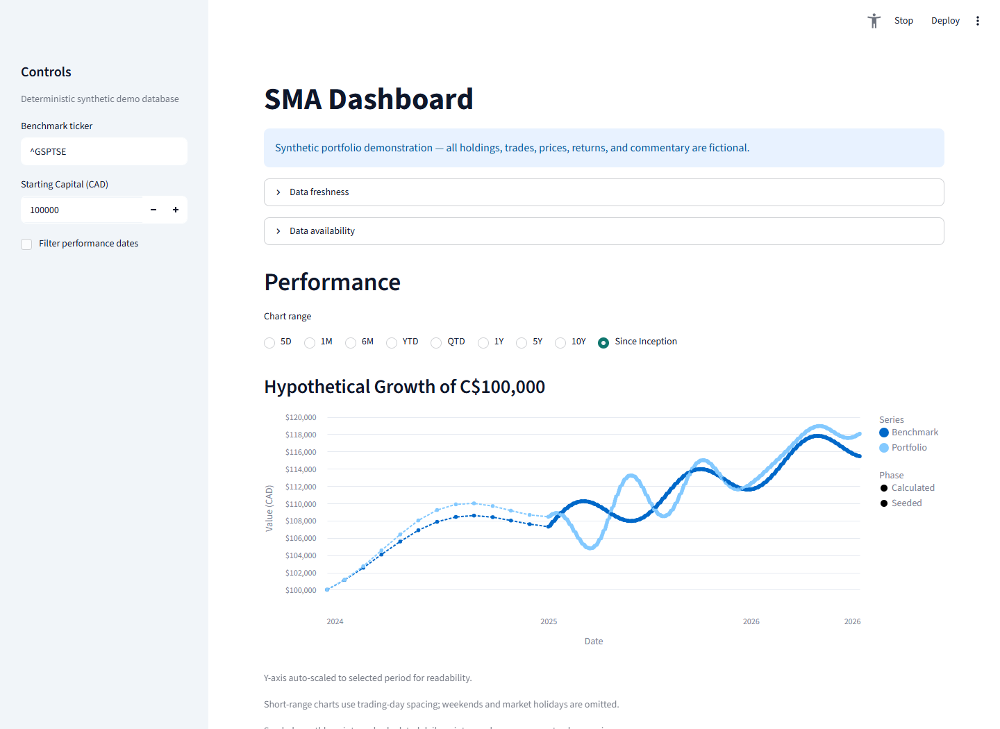
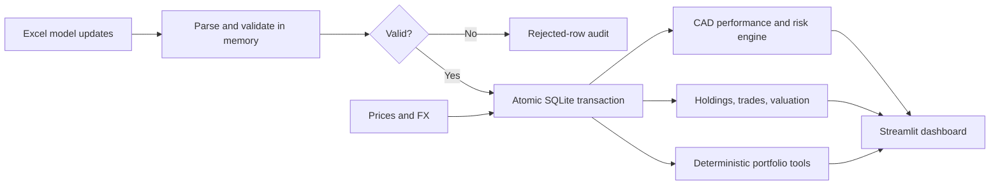

# SMA Oversight Dashboard

[](https://github.com/bran-hub/sma-dashboard/actions/workflows/tests.yml)

[](LICENSE)

**A privacy-first Python data pipeline and Streamlit dashboard for independently auditing a separately managed account.** It converts periodic Excel model updates and stored market data into a reproducible CAD performance record, holdings view, trade log, risk dashboard, valuation overview, and portfolio assistant.

[Run the synthetic demo](#run-the-synthetic-demo-locally) · [Review the methodology](docs/METHODOLOGY.md) · [See the architecture](docs/ARCHITECTURE.md)



> All holdings, trades, prices, returns, and commentary in the public project are fictional. No real account files, credentials, or manager information are included.

## Why I built it

Manager reporting is useful, but it is not an independent source of truth. I built this project end to end to demonstrate how I would turn irregular portfolio updates into an auditable analytical product: validate inputs, preserve lineage, make timing and currency rules explicit, calculate performance reproducibly, and surface the results for review.

The result is less about another charting app and more about trustworthy analytics engineering:

- Atomic, idempotent Excel-to-SQLite ingestion with rejected-row auditing.
- Explicit CAD/USD security currency and local overrides for ambiguous symbols.
- CAD time-weighted returns with next-trading-day snapshot effectiveness.
- Buy-and-hold weight drift between snapshots and explicit residual cash.
- Deterministic synthetic data and offline assistant answers with no API key.
- 222 automated tests across Python 3.11, 3.12, and 3.13.

## 60-second tour

1. [Run the synthetic demo](#run-the-synthetic-demo-locally); the database is built locally from deterministic synthetic fixtures.
2. Review cumulative performance, trailing returns, drawdowns, and rolling risk against the S&P/TSX Composite.
3. Inspect holdings, weight drift, valuation, model-update history, and the normalized trade log.
4. Ask the offline assistant “What are the largest holdings?”, “How has the portfolio performed?”, or “Summarize the latest manager commentary.”

The demo contains 16 holdings rows, 12 trades, 1,840 stored price observations, 368 FX observations, 13 seeded monthly returns, and one synthetic manager transcript.

## Data flow



| Layer | Implementation |
|---|---|
| Ingestion | pandas, openpyxl, configurable mappings, transactional writes |
| Storage | SQLite as the reproducible local source of truth |
| Analytics | CAD TWR, benchmark comparison, trailing returns, rolling risk |
| Interface | Streamlit and Altair |
| Quality | pytest and GitHub Actions on Python 3.11–3.13 |

See [Architecture](docs/ARCHITECTURE.md), [Methodology](docs/METHODOLOGY.md), [Privacy](docs/PRIVACY.md), and [Roadmap](docs/ROADMAP.md).

## Key engineering decisions

- **SQLite over flat files:** lightweight and local, while preserving queryability, constraints, and reproducible history.
- **TWR over IRR:** measures manager decisions without conflating them with the timing of account contributions and withdrawals.
- **Next-observed-day effectiveness:** prevents a new holdings snapshot from creating same-day look-ahead bias.
- **Stored prices and FX:** calculations can be reproduced instead of silently changing with each market-data request.
- **Synthetic hosted mode:** lets reviewers use the complete stored-data path without exposing private data or relying on live services.

## Run the synthetic demo locally

```powershell
python -m venv .venv
.\.venv\Scripts\Activate.ps1
python -m pip install -e ".[dev]"
python run_demo.py
```

`run_demo.py` builds `data/db/sma_demo.db` and launches Streamlit without downloading market data. The assistant starts in offline mock mode and needs no API key.

## Use with private local data

Initialize the database:

```powershell
python init_db.py --db data/db/sma_dashboard.db
```

Copy the example ticker override files to ignored `.local.json` files if needed, then ingest one update:

```powershell
python ingestion.py `
  --file data/raw/manager_model_update_YYYY-MM-DD.xlsx `
  --model-date YYYY-MM-DD `
  --db data/db/sma_dashboard.db `
  --ticker-overrides config/ticker_overrides.local.json `
  --ticker-currency-overrides config/ticker_currency_overrides.local.json
```

Use `--skip-market-data` for offline validation. Re-running an applied model date is rejected by default; use `--replace-date` only for an intentional atomic replacement. Ordered batch ingestion is also available through `ingest_model_updates.py` and a private manifest.

Run the app:

```powershell
$env:SMA_DASHBOARD_DB = "data/db/sma_dashboard.db"
streamlit run dashboard.py
```

## Optional portfolio assistant

The public demo uses `SMA_CHAT_MODE=mock`: questions are classified locally and answered by deterministic Python tools against the selected SQLite database. No prompt or portfolio data leaves the machine.

For opt-in live Anthropic mode:

```powershell
python -m pip install -e ".[chatbot]"
$env:SMA_ENABLE_CHAT = "1"
$env:SMA_CHAT_MODE = "anthropic"
streamlit run dashboard.py
```

Copy `.streamlit/secrets.toml.example` to the ignored `.streamlit/secrets.toml` and add `ANTHROPIC_API_KEY`. Live mode may send the question and tool results to Anthropic; review the data-sharing implications before enabling it. The API key is never required for the demo or CI.

## Methodology and limitations

Performance is daily, CAD-denominated time-weighted return. Target weights initialize the portfolio at each new snapshot, then drift with relative returns until the next snapshot. Weight below 100% is residual cash earning 0%; long-only snapshots above 100% are rejected. Missing prices or required FX rates are surfaced rather than silently dropping and renormalizing positions.

This is an oversight and analytics-engineering portfolio project—not brokerage, accounting, tax, or investment-advice software. yfinance is convenient for demonstration but does not carry production service guarantees.

## Quality and privacy

```powershell
python -m pytest
python -m sma_dashboard.demo --output data/db/demo-smoke.db
```

Real inputs belong only in ignored paths such as `data/raw/`, `data/db/`, `.streamlit/secrets.toml`, and local override files. Public releases are produced through an allowlisted export with filename/content deny checks; private development history is never merged into the public repository. See [Privacy](docs/PRIVACY.md).

## License

MIT. See [LICENSE](LICENSE).
